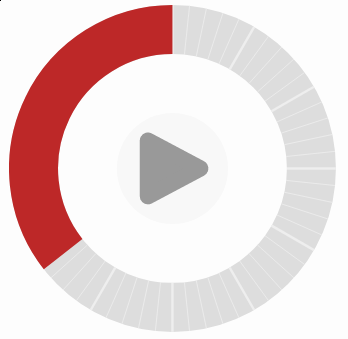

# A visual task timer

This timer is a web component to help with time awareness by visually showing
the passage of time. Timers like this can help with focus and
combat time blindness by showing time as space. Use it on the [**live
demo**](https://c42f.github.io/tasktimer/index.html) example page.

## Design

In this timer, the full circle always represents a single hour of time. I think
this is nice because
* There's a *stable correspondence between time and space* in the angle
  around the circle, regardless of where you choose to start the timer.
* A maximum of one hour is a *good human scale for time*: large enough to get
  started on something but not too intimidating. Few-minute tasks can still be
  measured.
* It's *familiar* from the analog clock face

The timer is designed for starting and continuing tasks which require focus,
assuming more time spent is better. So it continues counting in a
non-distracting way when the allotted time is finished.

A small bar marks the initial allotted time so that it's very easy to see time
disappearing immediately when the timer starts. This shows time as the precious
and non-renewable resource that it is.

## Resources

It's possible to get physical versions of timers like this, for example the
[Time Timer](https://www.timetimer.com).

Thanks to `@Stanko` for the [Sektor library](https://github.com/Stanko/sektor)
which gave inspiration for the approach here using animated SVG arcs.
